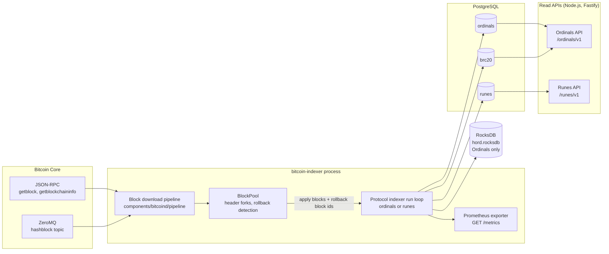

# Architecture

## The whole system at a glance

## One process, one protocol

The `bitcoin-indexer` binary runs exactly one protocol index per invocation. `ordinals ...` and
`runes ...` are separate long-lived processes with separate Postgres databases. They read the same
`Indexer.toml` but only the section they need. BRC-20 is not a separate process: it is a
meta-protocol indexed inside the Ordinals run loop, into its own database.

## Threads inside one process

`start_bitcoin_indexer` in `components/bitcoind/src/lib.rs` sets up four cooperating pieces.

| Thread | Source | Job |
| --- | --- | --- |
| Main async task | `components/bitcoind/src/lib.rs` | Waits for the node's chain tip, drives the historical download loop, then switches to the ZeroMQ stream |
| `block_download_processor` | `components/bitcoind/src/pipeline/mod.rs` | Receives raw blocks, standardizes them, advances the `BlockPool`, and emits apply/rollback commands |
| `ordinals_indexer` or `runes_indexer` | `components/ordinals/src/lib.rs`, `components/runes/src/lib.rs` | Consumes those commands and performs the actual Postgres work |
| Prometheus server | `components/*/src/utils/monitoring.rs` | Serves `GET /metrics` when `[metrics] enabled = true` |

The two internal channels are bounded by `resources.indexer_channel_capacity`. When Postgres is the
bottleneck, the download side blocks on a full channel rather than growing memory without limit. The
process logs `Indexer command channel full, waiting for space` at debug level when that happens.

## How a block becomes a row

1. **Discovery.** During catch-up the pipeline asks Bitcoin Core for a height range over JSON-RPC.
   Once caught up, it subscribes to the ZeroMQ `hashblock` topic and fetches each announced hash.
2. **Standardization.** `standardize_bitcoin_block` turns the raw block into the internal
   `BitcoinBlockData` shape used by both protocol indexers.
3. **Fork tracking.** The block's header enters the `BlockPool`. The pool maintains every known
   header fork, picks the longest as the accepted chain, and emits either
   `BlockchainUpdatedWithHeaders` (a simple extension) or `BlockchainUpdatedWithReorg` (headers to
   roll back plus headers to apply). See [Reorgs and mempool](reorgs-and-mempool.md).
4. **Indexing.** The protocol run loop receives `IndexBlocks { apply_blocks, rollback_block_ids }`.
   Rollbacks are executed first, block by block, then the new blocks are processed.
5. **Persistence.** Each block's protocol effects are written inside a Postgres transaction, and the
   `chain_tip` row is advanced in the same transaction.

## Ordinals specifics

The Ordinals path additionally writes a compacted copy of each block into a local RocksDB store at
`<storage.working_dir>/hord.rocksdb`. This archive lets inscription satoshi traversal look backwards
through transaction inputs without re-fetching blocks from the node. The Runes path does not use
RocksDB at all; its `compress_blocks` argument is `false`.

Two in-memory caches sit in front of Postgres:

- an L2 traversal cache (2048 entries) that is cleared every 100 processed blocks,
- a BRC-20 cache sized by `ordinals.meta_protocols.brc20.lru_cache_size`.

## Runes specifics

Runes indexing parses each transaction with the `ordinals` parser crate (version 0.0.15), applies
edicts, mints, etchings, burns, and cenotaph rules, and appends to a ledger table plus per-block
balance and supply snapshots. Its cache is sized by `runes.lru_cache_size`.

## The vendored `ord` component

`components/ord` is a trimmed copy of the `ord` reference implementation at version 0.22.2. It
supplies sat arithmetic, rarity, degree and epoch maths, inscription envelope parsing, charms, and
media type classification. It is compiled as a normal workspace crate. See
[Upstream relationship](upstream.md).

## The read APIs

Both APIs are Fastify servers with TypeBox schemas, and both are read-only. They connect directly to
the Postgres databases the indexer writes. They do not talk to the indexer process, they do not talk
to Bitcoin Core, and they have no way to trigger indexing. If the indexer is stopped, the APIs keep
serving whatever is already in Postgres, with a `block_height` in the status response that stops
advancing.
