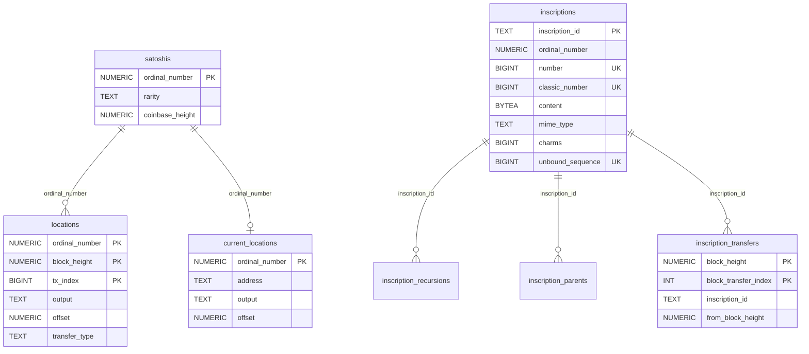

# Database model

Three independent PostgreSQL databases, one RocksDB store. Nothing is shared between them: there are
no cross-database foreign keys, and each database carries its own `chain_tip` or equivalent
progress marker.

| Store | Written by | Purpose |
| --- | --- | --- |
| `ordinals` Postgres database | Ordinals index | Inscriptions, satoshi rarity, locations, transfers, aggregate counts |
| `brc20` Postgres database | Ordinals index, when BRC-20 is enabled | Tokens, operations, balances |
| `runes` Postgres database | Runes index | Runes, ledger, balance and supply changes |
| `<working_dir>/hord.rocksdb` | Ordinals index | Compacted block archive used for satoshi traversal |

## Migrations

Migrations are [Refinery](https://github.com/rust-db/refinery) SQL files, embedded into the binary at
compile time from `migrations/<name>/`. That means a given binary can only ever apply the migrations
it was built with, and upgrading the schema means deploying a new binary.

| Directory | Applies to | Current count |
| --- | --- | --- |
| `migrations/ordinals` | `ordinals` database | 18 |
| `migrations/ordinals-brc20` | `brc20` database | 7 |
| `migrations/runes` | `runes` database | 5 |

Refinery records applied versions in its own `refinery_schema_history` table inside each database.
Migrations run automatically at the start of `service start` and `index sync`, and can be run alone
with `database migrate`.

Naming is `V<n>__<description>.sql`, applied in ascending `n`. Files are append-only: never edit an
already released migration, because Refinery compares checksums of applied versions.

Two migrations do data work as well as schema work, which is worth knowing before you time an
upgrade on a large database:

- `V15__inscription_parents.sql` copies every non-null `inscriptions.parent` into the new
  `inscription_parents` table, then drops the column.
- `V18__chain_tip_block_hash.sql` adds `chain_tip.block_hash` and backfills it from the highest row
  in `locations`.

## Ordinals schema

| Table | Primary key | What it holds |
| --- | --- | --- |
| `satoshis` | `ordinal_number` | Every satoshi that has ever carried an inscription, with its rarity and coinbase height |
| `inscriptions` | `inscription_id` | One row per inscription, including the full content bytes, mime type, fee, curse type, charms, metadata, and delegate |
| `locations` | `(ordinal_number, block_height, tx_index)` | Full movement history of inscribed satoshis, with previous output and offset |
| `current_locations` | `ordinal_number` | Denormalized latest location, for ownership queries |
| `inscription_transfers` | `(block_height, block_transfer_index)` | Transfer events ordered within a block, used to serve transfers-per-block |
| `inscription_recursions` | `(inscription_id, ref_inscription_id)` | Recursive inscription references. Cascades on inscription delete. |
| `inscription_parents` | `(inscription_id, parent_inscription_id)` | Provenance parents. Cascades on inscription delete. |
| `chain_tip` | single-row `id` | Index progress: `block_height` and `block_hash` |
| `counts_by_block` | `block_height` | Per-block and running inscription counts |
| `counts_by_mime_type`, `counts_by_sat_rarity`, `counts_by_type`, `counts_by_address`, `counts_by_genesis_address`, `counts_by_recursive` | the grouping column | Maintained aggregate counters, so the API does not scan `inscriptions` for totals |

The single-row `chain_tip` table is enforced with `CHECK(id)` on a `BOOLEAN PRIMARY KEY`, so there is
exactly one row.

Inscription content is stored in-row as `BYTEA`. This is the dominant driver of the Ordinals database
size.

## BRC-20 schema

| Table | Primary key | What it holds |
| --- | --- | --- |
| `tokens` | `ticker` | Deploy parameters: `max`, `limit`, `decimals`, `self_mint`, plus running `minted_supply` and `tx_count` |
| `operations` | `(inscription_id, operation)` | Every deploy, mint, transfer, and transfer-send, with amounts and addresses. Foreign key to `tokens` with cascade delete. |
| `balances` | `(ticker, address)` | Current available, transferable, and total balance per holder |
| `balances_history` | `(address, ticker, block_height)` | Per-block balance snapshots, which is what makes rollback exact |
| `counts_by_operation` | `operation` | Aggregate counters |
| `counts_by_address_operation` | `(address, operation)` | Aggregate counters |

There is no `chain_tip` table here. BRC-20 progress follows the Ordinals index, because both are
written by the same process in the same block loop.

## Runes schema

| Table | Primary key | What it holds |
| --- | --- | --- |
| `runes` | `id` (for example `840000:1`) | Etching record: name, spaced name, divisibility, premine, symbol, terms, turbo and cenotaph flags |
| `ledger` | none, indexed by rune, height, address, and `(tx_id, output)` | Append-only event log. `operation` is an enum of `etching`, `mint`, `burn`, `send`, `receive`. |
| `balance_changes` | `(rune_id, block_height, address)` | Per-block balance snapshot per holder |
| `supply_changes` | `(rune_id, block_height)` | Per-block minted, burned, and operation totals |

The per-block snapshot design in `balance_changes` and `supply_changes` is what lets a rollback be a
delete by `block_height` rather than a replay.

## Querying directly

The read APIs are the supported interface, and the schema is an implementation detail that
migrations may change. If you do query Postgres directly:

- Read from a replica, not from the database the indexer is writing.
- Treat `chain_tip.block_height` as the only trustworthy statement of how far the index has
  progressed.
- Do not assume a block is final. See [Reorgs and mempool](reorgs-and-mempool.md).

## The RocksDB block archive

`<storage.working_dir>/hord.rocksdb` holds compacted block data for the Ordinals index. Inscription
satoshi traversal reads it to follow transaction inputs backwards without re-fetching blocks from the
node. RocksDB `max_open_files` is set from `resources.ulimit`.

**It is part of the Ordinals index state, not a disposable cache.** At startup the Ordinals indexer
computes its effective chain tip from both stores, and the rules are worth memorizing before you
touch the directory:

| Postgres `chain_tip` | RocksDB archive | Effective start |
| --- | --- | --- |
| present | present | The lower of the two heights. A lagging archive forces Postgres blocks to be reprocessed. |
| present | missing or empty | Treated as no progress at all. Indexing restarts from block 0. |
| empty | present | The lower of the archive height and the first-inscription height minus one |
| empty | missing | Block 0 |

So deleting `hord.rocksdb` on a fully synced node does not just drop a cache: it triggers a full
re-download from block 0. Back it up with the Postgres database, restore the two together, and keep
`storage.working_dir` on persistent storage. See [Operations](operations.md).

The Runes index does not use RocksDB and has no equivalent directory.
