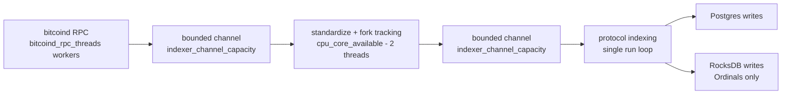

# Performance and sizing

This page describes what the tuning knobs actually do and how to reason about them. It deliberately
publishes no benchmark numbers, because none are measured in this repository and an invented figure
is worse than no figure. Measure on your own hardware.

## The pipeline and where it bottlenecks



The protocol run loop is single-threaded by design, because block order matters. So the ceiling is
almost always **Postgres write throughput**, with block download second. Adding cores past the point
where the run loop is saturated buys nothing.

Confirm which stage is limiting before tuning, using the stage histograms:

```console
curl -s localhost:9153/metrics | grep -E 'inscription_(parsing|computation|db_write)_time|block_processing_time'
```

If `inscription_db_write_time` dominates `block_processing_time`, the answer is Postgres, not the
indexer.

## The knobs

| Setting | Raise it when | Cost of raising it |
| --- | --- | --- |
| `resources.bitcoind_rpc_threads` | Download is the bottleneck during catch-up and your node has headroom | Load on Bitcoin Core, more blocks held in memory |
| `resources.cpu_core_available` | Parsing and computation dominate the stage histograms | None beyond the cores you actually have. The pool is `cpu_core_available - 2`, floor 1, so values below 3 all mean one worker. |
| `resources.indexer_channel_capacity` | The download side is idling while Postgres catches up | Directly multiplies peak memory: this is how many blocks may be in flight |
| `lru_cache_size` (BRC-20, Runes) | Cache misses are causing Postgres reads inside the hot path | Memory, roughly linear in entries |
| `resources.ulimit` | RocksDB is reopening files under load | Must stay at or below the OS file descriptor limit |

Two settings that read like knobs but are not: `resources.memory_available` is parsed and then
ignored, and `resources.bitcoind_rpc_timeout` is parsed and never used. See
[Configuration](configuration.md).

## Provisioning

### Indexer host

| Resource | Reasoning |
| --- | --- |
| CPU | Set `cpu_core_available` to what you will actually give the process. The download and sequencing pools size themselves from it. |
| Memory | 16 GB is a sensible starting point for mainnet Ordinals. Peak use scales with `indexer_channel_capacity` times block size, plus the caches. If the process is killed by the OOM killer during heavy blocks, lower `indexer_channel_capacity` first. |
| Disk | The RocksDB archive under `storage.working_dir` needs fast local storage and grows with the block range walked. |
| File descriptors | At least 4096 at the OS level, with `resources.ulimit` set at or below it. |

### PostgreSQL

The Ordinals database is the big one, because inscription content is stored in-row as `BYTEA` in the
`inscriptions` table. Its size tracks total inscribed bytes across the range you index, not block
count. Provision generously, put it on NVMe, and give it enough shared buffers that the hot indexes
stay resident.

The BRC-20 and Runes databases are much smaller: they store operations, per-block balance snapshots,
and ledger rows, with no blob content.

Practical points:

- Run Postgres on the same fast storage tier as the indexer, or on a low-latency link. The run loop
  is synchronous with respect to its writes.
- `pool_max_size` in the indexer configuration and `PG_CONNECTION_POOL_MAX` in the APIs must add up
  to something your Postgres `max_connections` can serve.
- Serve the read APIs from a replica if read traffic is significant. Nothing in the API path writes.

### API hosts

Both APIs are stateless. Scale horizontally behind a load balancer and point them all at the same
database or replica set. Give each replica its own `PG_CONNECTION_POOL_MAX` budget.

## Cheap wins

- **Use ETags.** The Ordinals API revalidates inscription reads with `If-None-Match` and answers
  `304` when nothing changed. A polling client that ignores ETags does full work every poll.
- **Ask for the count you need.** `limit` caps at 60 on the Ordinals API and at
  `API_RESULTS_MAX_LIMIT` on the Runes API. Deep `offset` paging is the expensive access pattern;
  narrow with filters instead.
- **Use the stats endpoint.** `GET /ordinals/v1/stats/inscriptions` reads the maintained
  `counts_by_block` table rather than scanning `inscriptions`.
- **Disable what you do not serve.** Omitting the `[ordinals.meta_protocols.brc20]` tree stops BRC-20
  work entirely, which removes a database and a cache from the hot path.
