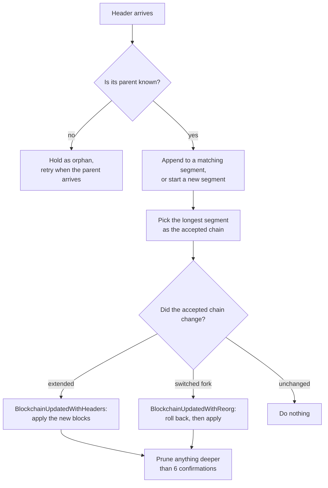

# Reorgs and mempool

These are the two behaviours that surprise integrators most often, so both are stated plainly here.

## Mempool: there is none

The indexer subscribes to exactly one ZeroMQ topic, `hashblock`. A message on any other topic is
skipped with a `Topic not supported` warning. There is no `rawtx` subscription, no `getrawmempool`
call, and no unconfirmed state anywhere in the schema.

Consequences to design around:

- **Everything served has been mined.** An inscription or rune that exists only in the mempool is
  invisible to this indexer and to both APIs.
- **There is no pending or unconfirmed status.** No table has one and no API response exposes one.
  If a response contains a row, that row came from a block.
- **Latency is one block plus indexing time.** New data appears after the block containing it is
  mined, announced over ZeroMQ, downloaded, and committed to Postgres.
- **Replace-by-fee is not modelled.** A replaced transaction that never gets mined simply never
  appears.

If you need mempool awareness, get it from a mempool source and join it to this index yourself.

## Reorgs: detected and rolled back automatically

The indexer keeps an in-memory model of recent block headers in `BlockPool`
(`components/bitcoind/src/block_pool/mod.rs`) and reconciles Postgres against it.



### Fork selection

Every known header segment is tracked. The segment with the greatest length wins. Selection is by
segment length, not by cumulative work.

### What a reorg does to the database

A `BlockchainUpdatedWithReorg` event carries `headers_to_rollback` and `headers_to_apply`. The
protocol run loop handles rollback first, one block at a time, in this order:

1. Delete the block from the RocksDB archive (Ordinals only).
2. Run `rollback_block` for that height inside a Postgres transaction.
   - **Ordinals:** removes the block's inscriptions, locations, transfers, and derived counts, and
     rewinds `chain_tip`.
   - **BRC-20:** removes the block's operations and restores balances from `balances_history`,
     in its own transaction against the BRC-20 database.
   - **Runes:** removes the block's `ledger`, `balance_changes`, and `supply_changes` rows.
3. Flush RocksDB.

Only then are the replacement blocks applied. Because BRC-20 and Runes both keep per-block snapshot
tables, a rollback restores exact prior state instead of replaying from the start.

### Confirmation depth

`CONFIRMED_SEGMENT_MINIMUM_LENGTH` is 7. Once the accepted chain held in memory is at least seven
blocks long, everything from the sixth ancestor downwards is treated as confirmed: those headers are
emitted as confirmed, dropped from the in-memory header store, and their competing forks and orphans
are pruned.

**That is the practical reorg limit of the indexer.** A reorg deeper than six blocks is past what
the in-memory pool can reconcile by itself. Recovering from one means a manual rollback:

```console
bitcoin-indexer ordinals index rollback 20 --config-path ./Indexer.toml
bitcoin-indexer ordinals index sync --config-path ./Indexer.toml
```

Pick a depth comfortably past the fork point.

### A ZeroMQ quirk the code works around

When the node switches forks, the `hashblock` topic announces only the new tip, not the intermediate
blocks of the new branch. The pipeline notices that the announced header's parent is unknown, fetches
the parent over JSON-RPC, and walks backwards until it reaches a header the pool already holds. So
`Received non-canonical block` in the logs immediately before a reorg is the workaround starting, not
an error.

### What integrators should do

- Treat data less than six blocks deep as provisional.
- Poll the status endpoint (`GET /ordinals/v1/` or `GET /runes/v1/`) and watch `block_height`. A
  height that moves backwards is a reorg, and is your signal to re-read anything cached from the
  affected range.
- Do not cache an inscription location or a rune balance across a block boundary without
  revalidating. The Ordinals API supports `ETag`, which makes revalidation cheap. See the
  [API reference](api/README.md).

## Where the Bitcoin Universe product surfaces get their data

The capability snapshot published by the documentation portal records, per protocol, which indexer
each Bitcoin Universe surface reads and what its reorg policy is. That snapshot is the source of
truth for product behaviour. This repository documents the behaviour of this indexer only. Being
able to run this indexer is not the same thing as a product surface reading from it.
