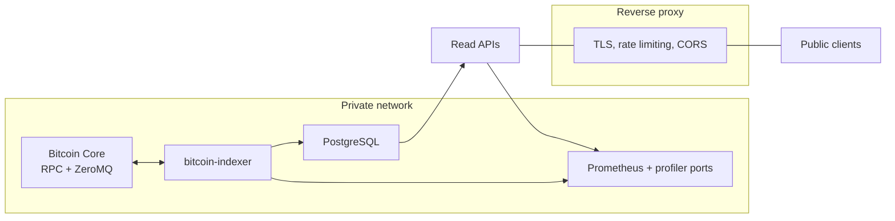

# Security considerations

## Trust boundaries



The only component intended to face the public network is the REST port of each read API, and even
that should sit behind a proxy.

## What this software does not do

Stating these plainly, because they remove whole categories of risk from your threat model:

- It holds no private keys and performs no signing.
- It builds and broadcasts no transactions.
- It has no write endpoints, no authentication, and no session state.
- It reads no user-supplied data other than HTTP query and path parameters, all of which are
  schema-validated before reaching a handler.

## Credentials

`Indexer.toml` contains Bitcoin Core RPC credentials and Postgres credentials in plaintext. The API
services take Postgres credentials from the environment or a `.env` file.

- Keep `Indexer.toml` and `.env` out of version control and off shared volumes.
- Give the indexer a dedicated Postgres role scoped to its own databases. It needs to create tables,
  types, and indexes there, and nothing outside them.
- Give each API a **read-only** Postgres role. Nothing in the API path writes.
- Give Bitcoin Core an RPC user restricted to what the indexer calls: `getblockchaininfo`,
  `getblockhash`, `getblock`.

## Transport

- **Postgres connections are made without TLS.** The connection manager is built with `NoTls`. Keep
  the indexer and Postgres on a trusted network segment, or tunnel the connection yourself. Do not
  send these connections across an untrusted link expecting encryption.
- **`bitcoind.rpc_url` must be `http://`.** The client derives the `Host` header by slicing the first
  seven characters off the URL, so an `https://` value produces a malformed header. Keep the RPC
  link on a private network.

## Ports to keep off the public internet

| Port | Belongs to | Why |
| --- | --- | --- |
| `metrics.prometheus_port` on the indexer | Indexer | Binds `0.0.0.0`, exposes indexing internals |
| 9153 on each API | API Prometheus server | Exposes request patterns and index state |
| `PROFILER_PORT`, default 9119 | Ordinals API profiler | Node.js profiling controls |
| Bitcoin Core RPC and ZeroMQ | Node | Direct node control |
| PostgreSQL | Database | Plaintext connections |

Set `API_HOST` to a private address and publish only the REST port through a proxy, or bind
everything privately and expose the REST port through the proxy alone. The indexer metrics port
binds `0.0.0.0` unconditionally, so restrict it at the firewall.

## What the proxy in front of the APIs should do

The services themselves implement none of this:

- **TLS termination.** Neither service serves HTTPS.
- **Rate limiting.** There is none in the code. `GET /inscriptions` with wide filters and deep
  `offset` is an expensive request that anyone can issue.
- **CORS policy.** Both services register `@fastify/cors` with default settings, which allows any
  origin. Override at the proxy if you need a narrower policy.
- **Request size and timeout limits** appropriate to your deployment.

Both services set `trustProxy: true`, so they take client addresses from forwarding headers. Make
sure your proxy overwrites `X-Forwarded-For` rather than appending to a client-supplied value,
otherwise clients can spoof the address that appears in your logs and metrics.

## Data exposure

Everything in these databases is derived from the public Bitcoin blockchain, so there is no
confidential payload. Two points are still worth planning for:

- **Inscription content is served verbatim.** `GET /inscriptions/{id}/content` returns arbitrary
  bytes uploaded by arbitrary people, under a content type those people chose. If you render it in a
  browser context, serve it from a separate origin with a restrictive `Content-Security-Policy`, and
  do not trust the declared content type.
- **Address queries are ordinary lookups.** Anyone can enumerate holdings by address. That is a
  property of the chain, not of this software, but it belongs in your privacy assessment.

## Dependencies

The Rust toolchain is pinned in `rust-toolchain.toml`, and dependency versions are pinned in
`Cargo.lock`. The APIs pin dependencies in their `package-lock.json` files, and Node.js is pinned to
24.19.0 in CI.

There is no `.github/dependabot.yml` in this repository and GitHub's Dependabot security updates are
not enabled on it, so dependency updates are a manual job here. Audit them yourself before a
deployment:

```console
cargo update --dry-run
(cd api/ordinals && npm audit)
(cd api/runes    && npm audit)
```

Because this is a fork, upstream security fixes arrive through a merge from upstream rather than
through a release of this repository. See [Upstream relationship](upstream.md).

## Reporting

See [SECURITY.md](../SECURITY.md) in the repository root.
