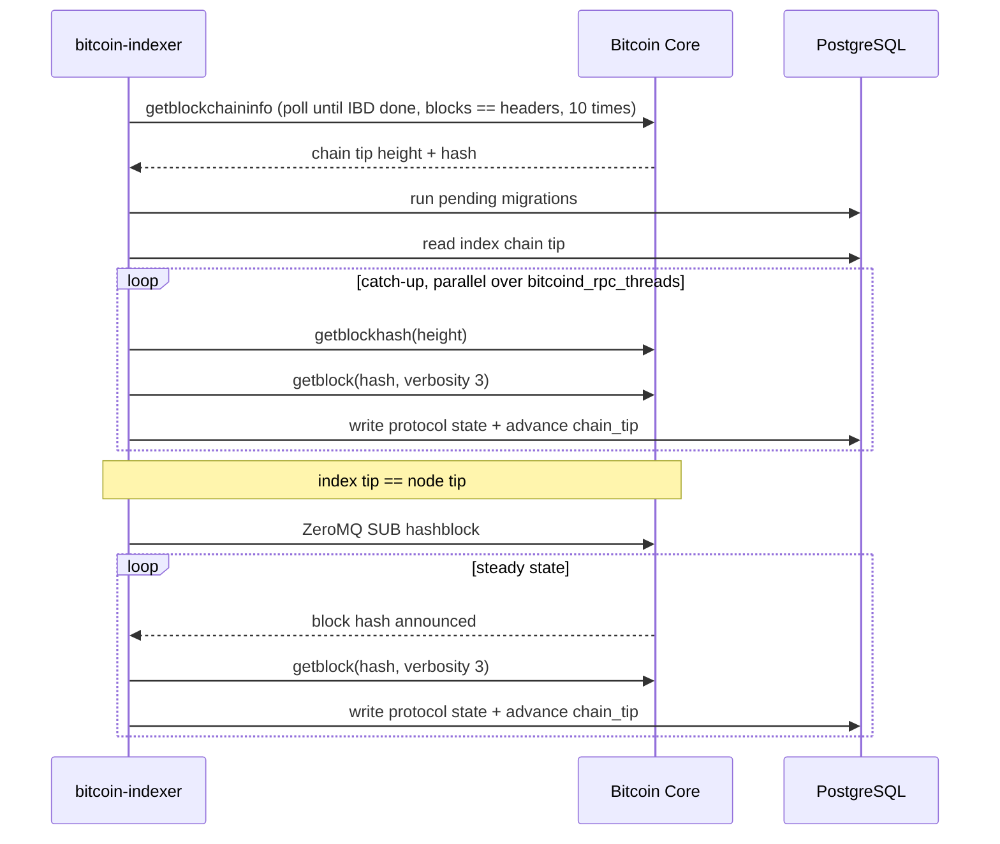

# Synchronization

## The two phases



The catch-up loop repeats: after each pass the indexer re-reads the node's chain tip, because the
node may have advanced while indexing was running.

`index sync` stops at the end of catch-up. `service start` continues into the ZeroMQ phase.

## Where indexing starts

The indexer never processes blocks before the protocol's first relevant block. Blocks below the
start height are still walked for the Ordinals block archive, but no protocol state is derived from
them.

| Index | Network | Start height |
| --- | --- | --- |
| Ordinals | mainnet | 767430 |
| Ordinals | testnet | 2413343 |
| Ordinals | signet | 112402 |
| Ordinals | devnet (regtest) | 1 |
| Runes | mainnet | 840000 |

The Runes index only implements mainnet. Starting it against testnet, signet, or regtest panics on an
unimplemented branch in `get_rune_genesis_block_height`.

The Runes migration seeds the reserved `UNCOMMON•GOODS` rune at id `1:0`, height 840000, before any
block is read.

## Resuming

The index chain tip lives in the `chain_tip` table of each database. On startup the indexer reads it
and resumes from the next height. An empty database logs `Index is empty` and starts from the
protocol start height above.

Because the chain tip is advanced in the same Postgres transaction as the block's protocol writes, a
crash mid-block leaves the tip pointing at the last fully committed block. Restarting reprocesses
that block and continues.

## What drives the speed

| Factor | Effect |
| --- | --- |
| `resources.bitcoind_rpc_threads` | Concurrent `getblock` calls during catch-up. The node, not the indexer, is usually the limit here. |
| `resources.cpu_core_available` | Thread pool for block decompression and inscription sequencing, sized `cpu_core_available - 2` |
| `resources.indexer_channel_capacity` | How far the download side may run ahead of Postgres. Larger means more memory held in flight. |
| `lru_cache_size` (BRC-20 and Runes) | Cache hits avoid Postgres reads inside the hot path |
| Postgres write throughput | The Ordinals index writes inscription content as `BYTEA`, so disk write bandwidth matters |

## Expected duration and resource use

A full mainnet Ordinals sync from height 767430 is a multi-day job on typical hardware, and its cost
is dominated by inscription content volume rather than by block count. This repository does not
publish measured sync times, and none are asserted here. Measure on your own hardware before
committing to a maintenance window:

```console
# watch the indexed height advance
curl -s localhost:9153/metrics | grep '^last_indexed_block_height'
```

Divide the observed blocks per minute into the remaining block count to get an estimate that is true
for your machine. Expect the rate to fall sharply across the heavy inscription epochs.

## Running Ordinals and Runes together

They are independent processes with independent chain tips, independent databases, and independent
progress. One can be at the node tip while the other is thousands of blocks behind. Each needs its
own `[metrics] prometheus_port` if you want both exporters, because the port is taken from the shared
configuration file: run them with separate configuration files, or accept that only the first process
to bind the port gets it.

## Stopping cleanly

Send `SIGINT`. The abort flag is checked between blocks and between commands, so shutdown takes as
long as the block in flight. See [CLI reference](cli.md).
